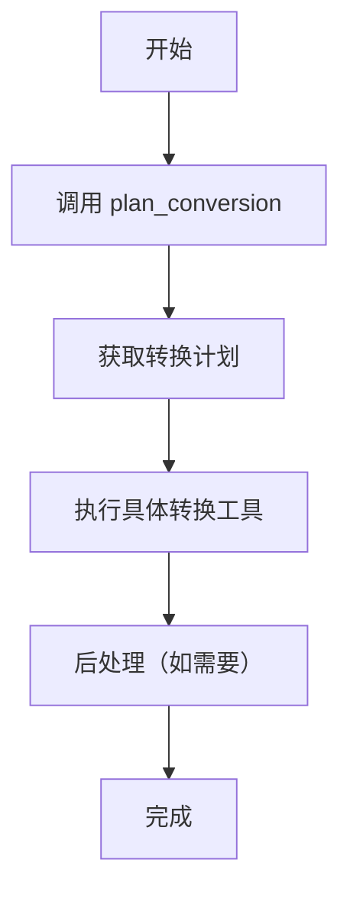
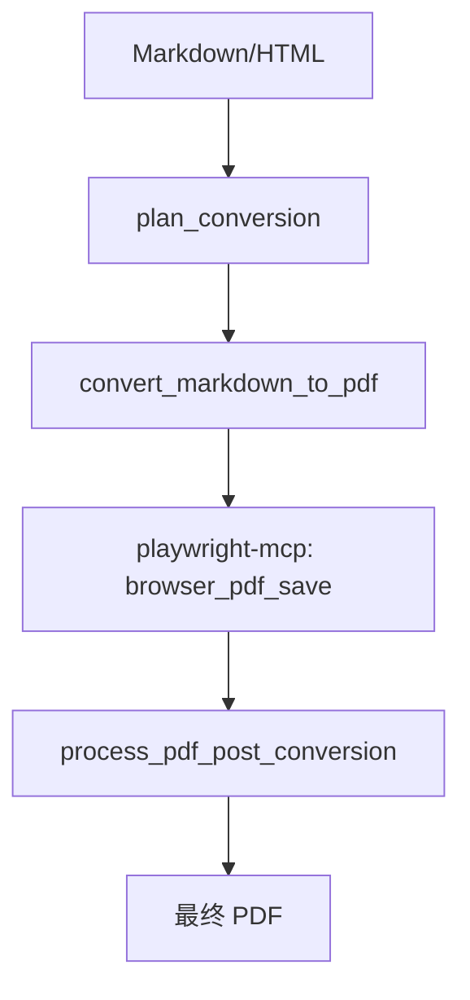

# MCP 文档转换工具使用指南

## 概述

本指南介绍如何使用最新的 MCP (Model Context Protocol) 文档转换工具。这些工具提供了强大的文档处理和转换功能，支持多种格式之间的转换。

## 🚀 核心特性

- **智能转换规划** - 自动分析最优转换路径
- **多格式支持** - PDF、DOCX、HTML、Markdown、TXT
- **增强功能** - 水印、二维码、样式主题
- **高质量输出** - 保持格式和样式完整性
- **批量处理** - 支持批量文档转换

## 📋 可用工具列表

### 🎯 核心工具

| 工具名称 | 功能描述 | 必需性 |
|---------|----------|--------|
| `plan_conversion` | **智能转换规划器** | ⚠️ **必须首先调用** |
| `read_document` | 读取文档内容 | 基础功能 |
| `write_document` | 写入文档内容 | 基础功能 |
| `convert_document` | 通用文档转换 | 核心功能 |

### 📝 Markdown 专用工具

| 工具名称 | 目标格式 | 特殊功能 |
|---------|----------|----------|
| `convert_markdown_to_html` | HTML | 主题支持、目录生成 |
| `convert_markdown_to_docx` | DOCX | 学术格式、样式保持 |
| `convert_markdown_to_pdf` | PDF | 需要 playwright-mcp |

### 🌐 HTML 转换工具

| 工具名称 | 目标格式 | 特殊功能 |
|---------|----------|----------|
| `convert_html_to_markdown` | Markdown | 样式保持、CSS 处理 |

### 📄 PDF 处理工具

| 工具名称 | 功能描述 | 使用场景 |
|---------|----------|----------|
| `process_pdf_post_conversion` | PDF 后处理 | playwright-mcp 后续步骤 |

### ✨ 增强功能工具

| 工具名称 | 功能描述 | 支持格式 |
|---------|----------|----------|
| `add_watermark` | 添加水印 | PDF |
| `add_qrcode` | 添加二维码 | PDF |

## 🔄 标准转换工作流

### 1. 基本转换流程



### 2. PDF 转换特殊流程



## 📖 使用示例

### 示例 1: 智能转换规划（必需的第一步）

```json
{
  "tool": "plan_conversion",
  "params": {
    "sourceFormat": "markdown",
    "targetFormat": "pdf",
    "sourceFile": "/path/to/document.md",
    "preserveStyles": true,
    "theme": "github",
    "quality": "high"
  }
}
```

### 示例 2: Markdown 转 HTML

```json
{
  "tool": "convert_markdown_to_html",
  "params": {
    "markdownPath": "/input/document.md",
    "outputPath": "/output/document.html",
    "theme": "github",
    "includeTableOfContents": true,
    "preserveStyles": true
  }
}
```

### 示例 3: 完整的 PDF 转换工作流

```json
// 步骤 1: 规划转换
{
  "tool": "plan_conversion",
  "params": {
    "sourceFormat": "markdown",
    "targetFormat": "pdf",
    "theme": "academic"
  }
}

// 步骤 2: Markdown 转 PDF
{
  "tool": "convert_markdown_to_pdf",
  "params": {
    "markdownPath": "/input/document.md",
    "theme": "academic",
    "includeTableOfContents": true
  }
}

// 步骤 3: PDF 后处理
{
  "tool": "process_pdf_post_conversion",
  "params": {
    "playwrightPdfPath": "/tmp/generated.pdf",
    "targetPath": "/output/final.pdf",
    "addWatermark": true,
    "addQrCode": true
  }
}
```

## ⚙️ 配置选项

### 主题选项

- `default` - 默认样式
- `github` - GitHub 风格
- `academic` - 学术论文风格
- `modern` - 现代简约风格
- `professional` - 专业商务风格

### 质量选项

- `fast` - 快速转换
- `balanced` - 平衡质量和速度
- `high` - 高质量输出

### 位置选项（水印/二维码）

- `top-left` / `top-right` / `top-center`
- `bottom-left` / `bottom-right` / `bottom-center`
- `center` / `fullscreen`

## 🌍 环境变量

| 变量名 | 描述 | 示例 |
|--------|------|------|
| `OUTPUT_DIR` | 默认输出目录 | `/path/to/output` |
| `WATERMARK_IMAGE` | 默认水印图片 | `/assets/watermark.png` |
| `QR_CODE_IMAGE` | 默认二维码图片 | `/assets/qrcode.png` |

## 📏 文件大小限制

| 格式 | 最大文件大小 | 处理速度 | 内存使用 |
|------|-------------|----------|----------|
| PDF | 50MB | 2-5 页/秒 | 200-500MB |
| DOCX | 50MB | 5-10 页/秒 | 100-300MB |
| HTML | 50MB | 10-20 页/秒 | 50-150MB |
| Markdown | 50MB | 20-50 页/秒 | 20-100MB |
| TXT | 50MB | 50-100 页/秒 | 10-50MB |

## ⚠️ 重要注意事项

1. **必须先调用 `plan_conversion`** - 这是所有转换操作的第一步
2. **PDF 转换需要 playwright-mcp** - 用于最终的 PDF 生成
3. **后处理是必需的** - PDF 转换后必须调用 `process_pdf_post_conversion`
4. **路径处理** - 相对路径会基于 `OUTPUT_DIR` 环境变量解析
5. **依赖关系** - 确保所有必需的 MCP 服务器都在运行

## 🔧 故障排除

### 常见问题

**Q: 转换失败，提示找不到文件**
A: 检查文件路径是否正确，确保使用绝对路径或正确设置 `OUTPUT_DIR`

**Q: PDF 转换不完整**
A: 确保按顺序调用：`plan_conversion` → `convert_markdown_to_pdf` → `process_pdf_post_conversion`

**Q: 水印或二维码没有添加**
A: 检查环境变量 `WATERMARK_IMAGE` 和 `QR_CODE_IMAGE` 是否正确设置

**Q: 样式丢失**
A: 确保设置 `preserveStyles: true` 并选择合适的主题

### 调试模式

在转换参数中添加 `debug: true` 可以获取详细的调试信息。

## 📚 更多资源

- [MCP 协议文档](https://modelcontextprotocol.io/)
- [Playwright MCP 集成](https://github.com/microsoft/playwright)
- [示例代码](./mcpToolsExample.ts)

---

**版本**: 2.0.0  
**更新日期**: 2024年12月  
**兼容性**: MCP 协议 v1.0+